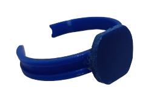

## Proceso de Diseño

El proceso de diseño de la pulsera HealthTag se centró en crear un dispositivo funcional y estéticamente agradable que pueda ser impreso en 3D de manera rápida y eficiente. A continuación, se describen los archivos y recomendaciones para la impresión:

### Archivos de Diseño

- **Pulsera.stl**: Este archivo contiene el diseño completo de la pulsera HealthTag. El diseño está optimizado para una impresión 3D profesional, asegurando durabilidad y gran velocidad de fabricación. El archivo está listo para ser impreso.

### Recomendaciones para la Impresión 3D

- **Material**: TPU es recomendado para asegurar una alta resistencia y durabilidad.
- **Tiempo de Impresión**: Aproximadamente 24 minutos en una impresora estándar como la Prusa MK4.

## Instrucciones de Armado de la Pulsera

Una vez impresa la pulsera, siga los pasos a continuación para ensamblar correctamente los componentes electrónicos:

1. **Preparación del NFC Tag:**
   - Tome el NFC tag y, utilizando una lija fina, moldéelo cuidadosamente para que se ajuste perfectamente al espacio designado en la pulsera. Este paso es crucial para asegurar un ajuste limpio y seguro.

   

      
      
     
   

2. **Adhesión del NFC Tag:**
   - Una vez que el tag esté correctamente moldeado, proceda a fijarlo en la pulsera utilizando un adhesivo adecuado. Asegúrese de que el tag esté bien alineado y sujeto para evitar cualquier movimiento indeseado durante el uso.

3. **Finalización del Ensamblaje:**
   - Después de adherir el NFC tag, verifique que todos los componentes estén correctamente ensamblados y seguros dentro de la pulsera. Esto completa el proceso de armado de la pulsera HealthTag.

   

   

     
   

   
## Instrucciones de Armado del Hardware

El siguiente proceso explica cómo conectar los componentes clave de la pulsera HealthTag, específicamente el sensor de latidos cardíacos y la pantalla LCD.

### Conexión del Sensor de Latidos Cardíacos

1. **Identificación de Pines:**
   - El sensor de latidos cardíacos debe ser conectado al pin **IO33 (GPIO 33)** del IdeaBoard (ESP32). Este pin es adecuado para leer la señal analógica proveniente del sensor.
   
2. **Conexión del Sensor:**
   - Conecte el pin de señal del sensor al pin **IO33** del IdeaBoard.
   - Conecte el pin de alimentación del sensor a **3.3V** y el pin de tierra a **GND**.

### Conexión de la Pantalla LCD 16x2

1. **Identificación de Pines:**
   - La pantalla LCD debe conectarse a los pines **SDA (Pin 21)** y **SCL (Pin 22)** del IdeaBoard (ESP32). Estos pines son necesarios para la comunicación I2C entre el microcontrolador y la pantalla.

2. **Conexión de la Pantalla:**
   - Conecte el pin **SDA** de la pantalla al **Pin 21** del IdeaBoard.
   - Conecte el pin **SCL** de la pantalla al **Pin 22** del IdeaBoard.
   - Asegúrese de conectar los pines de alimentación de la pantalla a **5V** y **GND**.

### Imagen de Referencia de Pines

Para mayor claridad, consulte la siguiente imagen que muestra la disposición de los pines del IdeaBoard y las conexiones necesarias para el sensor de latidos cardíacos y la pantalla LCD:

  

Esta imagen ilustra claramente cómo deben ser conectados los componentes, asegurando que las conexiones sean precisas y estables.

---

Asegúrese de revisar todas las conexiones antes de alimentar el sistema para evitar daños en los componentes. Si tiene alguna duda, consulte la documentación 
