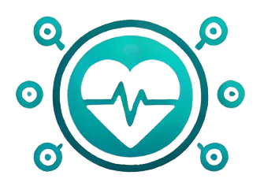
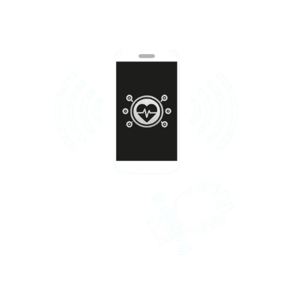
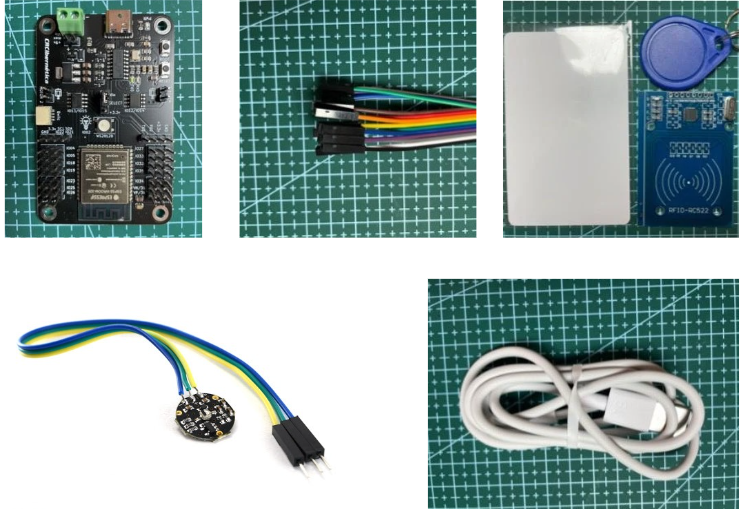

<h1> 
  HealthTag
</h1>

 
  

Documentación correspondiente al proyecto "HealthTag" para el proyecto de la Universidad Cenfotec ExpoCenfo.

 

## Olimpiadas de Computación (ExpoCenfo)

Es una competencia nacional abierta a todos los estudiantes que cursan alguna carrera universitaria, de cualquier área. En esta competencia tendrás la oportunidad de poner a prueba tus habilidades en el desarrollo de sistemas ciberfísicos, utilizando creatividad e ingenio para crear soluciones innovadoras y prácticas.

El reglamento completo del desarrollo y presentación de proyectos lo puedes encontrar en este [link](https://ucenfotec.ac.cr/expocenfo/).

 

<h2>Descripción del Proyecto:</h2> 

El proyecto de la Pulsera Médica tiene como objetivo desarrollar una pulsera inteligente integrada con tecnología RFID. Esta pulsera, al ser escaneada, mostrará la información médica del usuario en una página web móvil. El propósito es proporcionar acceso rápido a datos médicos críticos en caso de una emergencia, potencialmente salvando vidas al asegurar que los primeros auxilios tengan la información necesaria.

 

Además, de la mano con el desarrollo de la pulsera, se desarrollará el software necesario para gestionar y mostrar la información médica de cada usuario de manera segura y eficiente. Este software permitirá la visualización, actualización y administración de los datos médicos del usuario.

La pulsera también incorporará un lector de pulso, cuyos datos serán enviados a la aplicación y mostrados al ser escaneada. Esto permitirá a los primeros auxilios obtener no solo la información médica crítica, sino también datos actualizados sobre el estado del pulso del usuario.

 
  

## Objetivos:
1. Desarrollar la Pulsera RFID: Diseñar y crear la pulsera física con un chip RFID integrado.
2. Construir la Página Web Móvil: Crear una página web móvil receptiva y fácil de usar para mostrar la información médica del usuario cuando se escanee la pulsera.
3. Garantizar la Seguridad de los Datos: Implementar medidas de seguridad robustas para proteger los datos médicos del usuario.
4. Pruebas de Usuario y Retroalimentación: Realizar pruebas de usuario para recopilar retroalimentación y realizar las mejoras necesarias en la pulsera y la página web móvil.

## Características:
- Tecnología RFID: La pulsera incluirá un chip RFID integrado que permitirá de manera segura el intercambio de información entre el dispositivo y la página web.
- Accesibilidad Móvil: Al escanear la pulsera RFID, los datos médicos del usuario se mostrarán en una página web móvil. Esto garantiza que la información sea accesible desde cualquier teléfono inteligente.
- Información de Emergencia: La pulsera contendrá detalles médicos vitales como tipo de sangre, alergias, condiciones médicas, medicamentos y contactos de emergencia.
- Seguridad de Datos: Los datos del usuario estarán cifrados y almacenados de manera segura, garantizando la privacidad y protección contra accesos no autorizados.
- Diseño Amigable: La pulsera será cómoda de usar y diseñada para ser duradera, adecuada para el uso diario.

## Componentes:

- Microcontrolador IdeaBoard (ESP32)
- Módulo RFID
- Sensor de Frecuencia Cardíaca
- Cables varios (USB y jumper)

 
  

## Tecnologías Utilizadas:
- Tecnología RFID: Para el chip integrado en la pulsera.
- Desarrollo Web: HTML, CSS y JavaScript para crear la página web móvil.
- Desarrollo Backend: Tecnologías del lado del servidor para manejar el cifrado de datos y el almacenamiento seguro.
- Base de Datos: Una base de datos en línea para almacenar y gestionar la información médica del usuario.

  

## Escenarios de Uso:
- Situaciones de Emergencia: Los primeros auxilios pueden acceder rápidamente a la información médica crítica escaneando la pulsera.
- Uso Diario: Los usuarios pueden usar la pulsera a diario sin incomodidad, sabiendo que su información médica está disponible en caso de emergencia.
- Instalaciones Médicas: Hospitales y clínicas pueden usar la pulsera para recuperar rápidamente la información del paciente durante el tratamiento.

</body>
