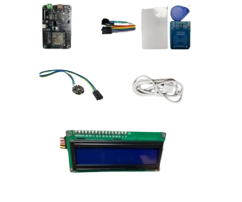

<div align="center">
<h1> 
  HealthTag
</h1>
<p align="center"> 
  
</p>

Documentación correspondiente al proyecto **HealthTag** para la **ExpoCenfo** de la Universidad Cenfotec.
</div>

<br/>

## Índice
- [ExpoCenfo](#expocenfo)
- [Descripción del Proyecto](#descripción-del-proyecto)
- [Objetivos](#objetivos)
- [Características](#características)
- [Componentes](#componentes)
- [Tecnologías Utilizadas](#tecnologías-utilizadas)
- [Escenarios de Uso](#escenarios-de-uso)
- [Instalación y Configuración](#instalación-y-configuración)
- [Contribución](#contribución)
- [Créditos y Reconocimientos](#créditos-y-reconocimientos)

<br/>

## ExpoCenfo

**ExpoCenfo** es una feria anual organizada por la Universidad Cenfotec, donde estudiantes de diversas disciplinas tienen la oportunidad de presentar proyectos innovadores en el ámbito del Internet de las Cosas (IoT). Esta competencia es una plataforma para que los participantes muestren su creatividad y habilidades en el desarrollo de sistemas ciberfísicos.

El reglamento completo del desarrollo y presentación de proyectos está disponible en este [link](https://ucenfotec.ac.cr/expocenfo/).

<br/>

## Descripción del Proyecto

**HealthTag** es una pulsera inteligente diseñada para proporcionar acceso rápido a información médica crítica en situaciones de emergencia. Integrando tecnología NFC y un sensor de frecuencia cardíaca, la pulsera permite a los socorristas escanear el dispositivo y obtener datos médicos esenciales del usuario, como antecedentes médicos, alergias, contactos de emergencia, y más.

El objetivo principal es salvar vidas al asegurar que los equipos de emergencia tengan acceso inmediato a la información que necesitan para tomar decisiones informadas. Además, el software complementario ofrece una interfaz para gestionar y actualizar la información médica de manera segura.

<p align="center"> 
  
</p>

## Objetivos
1. **Desarrollar la Pulsera HealthTag:** Diseñar y fabricar una pulsera cómoda y duradera con tecnología NFC.
2. **Construir el Sistema de Gestión Médica:** Crear una plataforma web intuitiva para mostrar y administrar la información médica del usuario.
3. **Garantizar la Seguridad de los Datos:** Implementar medidas de seguridad avanzadas para proteger la información médica del usuario.

## Características
- **Tecnología NFC:** Escaneo rápido y seguro para acceder a la información médica del usuario.
- **Monitoreo de Frecuencia Cardíaca:** Visualización en tiempo real de los datos del pulso a través de una pantalla integrada.
- **Acceso Móvil:** Visualización de datos a través de una página web optimizada para dispositivos móviles.
- **Información Médica Integral:** Detalles críticos como tipo de sangre, alergias, condiciones médicas, y contactos de emergencia.
- **Seguridad de Datos:** Cifrado avanzado y almacenamiento seguro de la información médica.
- **Diseño Ergonomico:** Pulsera ligera y resistente, diseñada para el uso diario.

## Componentes

- **Microcontrolador ESP32**
- **Módulo NFC/RFID**
- **Sensor de Frecuencia Cardíaca**
- **Cables y Conectores**

<p align="center"> 
  
</p>

## Tecnologías Utilizadas
- **NFC/RFID:** Para la identificación rápida y segura mediante la pulsera.
- **Desarrollo Web:** HTML, CSS y JavaScript para la creación de la interfaz de usuario.
- **Backend:** ASP.NET con C# para manejar la lógica de la aplicación y las comunicaciones con la base de datos.
- **Base de Datos:** SQL Server en Azure para el almacenamiento y gestión de los datos médicos.

## Escenarios de Uso
- **Emergencias Médicas:** Acceso instantáneo a información médica crucial durante una emergencia.
- **Uso Diario:** Comodidad y seguridad en el uso diario de la pulsera, con la tranquilidad de que su información médica está protegida.
- **Centros Médicos:** Uso en hospitales y clínicas para acceder rápidamente al historial médico del paciente.

## Instalación y Configuración

1. **Clonar el Repositorio:**
   ```bash
   git clone https://github.com/Universidad-Cenfotec/HealthTag.git
